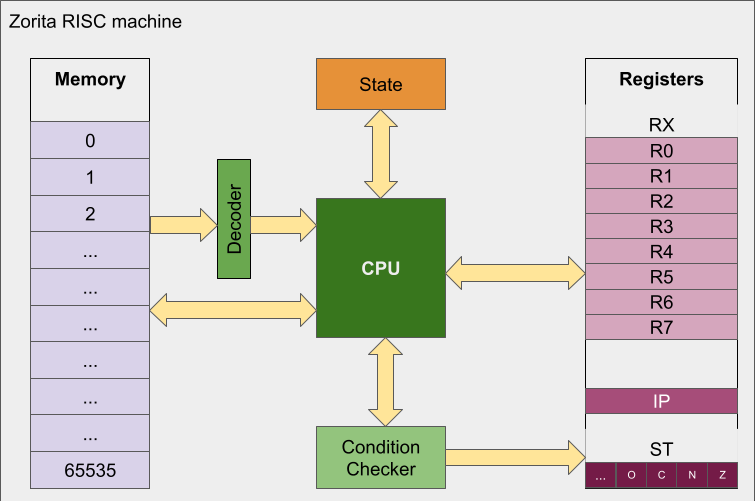

# Machine model

Zorita is a 16-bit RISC machine consisting of:
- a memory,
- a set of registers,
- a main instruction execution unit (CPU),
- a decoder, and
- a condition checker.

The state of the machine is also stored separately.

## Memory
Memory size is 64K words, each being 16-bit wide.  
The whole memory is addressable with a 16-bit register.

## Registers  
All registers are also 16-bit wide.

### Data registers
Data registers are used as general-purpose registers.  
There are 8 data registers: *R0*, *R1*, *R2*, *R3*, *R4*, *R5*, *R6*, and *R7*.

### Instruction pointer
The instruction pointer (*IP*) holds the address of the next instruction to be executed.  

### Status register
The status register (*ST*) holds a set of flags that provide information about the result of the last operation.  
The only operations that update the status register are CMP, ADD, and SUB.
- *ZF*: result was zero.
- *NF*: result was negative.
- *CF*: operation produced a carry.
- *OF*: operation produced an overflow.

## Memory image of a program  
The memory image of a program is the layout of a binary program once it has been loaded into memory.  
There are only 2 sections:
- An initialized DATA section, useful to allocate predefined values.
- A CODE section, where the actual machine code is stored.

### DATA section
The DATA section starts at memory position 0.
Memory position 0 should be initialized to the address of the first instruction.
That is, the address where the CODE section starts.
The rest of the DATA section could be used to store any other predefined values.
For example, considering the limitations of the instruction set, a target address for a JMP instruction.

### CODE section  
The CODE section can start anywhere.
For example, at the next address after the DATA section.
The address where the CODE section starts should be stored at memory position 0.

## Signedness   
Zorita is sign-agnostic.
That is, registers and memory positions are just treated as 16-bit strings.
CMP, ADD, and SUB operations update the status register flags.
The interpretation of those flags is then left to the programmer.

## Endianness  
Endianness is not applicable.
Since each memory position is 16 bits wide,
and all data types (operands, addresses, and instructions) fit in a single 16-bit word,
no multi-word storage is needed.

# Instruction set
Instructions are 16-bit long, where bit 15 is the most significant bit.
In the tables below, the most significant bits are shown leftmost.

Instruction opcode is always encoded as bits 15:13.  
Register operands are encoded as 3-bit values ranging from 000 (*R0*) to 111 (*R7*).  

## HALT
Stop the machine.

### Machine code
| 15:13 | 12:0 |
| :---: | :---: |
| 000 | — |

## CMP *op1*, *op2*
Where *op1* and *op2* are data registers.

Perform *op1* - *op2*, and update *ZF*, *NF*, *CF*, and *OF* flags.
Result of subtraction is not stored.

### Machine code
| 15:13 | 12:10 | 9:7 | 6:0 |
| :---: | :---: | :---: | :---: |
| 001 | *op1* | *op2* | — |

## JMP *cond*, *addr*
Where *cond* is a condition, and *addr* is a data register.  
The condition is encoded as a 4-bit value, as shown in the table below.

| Code | Condition     | Logic        | Code | Condition            | Logic        |
|:----:|:--------------|:-------------|:----:|:---------------------|:-------------|
| 0000 | Zero (Equal)  | ZF=1         | 1000 | Non-zero (Not equal) | ZF=0         |
| 0001 | Negative      | NF=1         | 1001 | Not negative         | NF=0         |
| 0010 | Carry         | CF=1         | 1010 | Not carry            | CF=0         |
| 0011 | Overflow      | OF=1         | 1011 | Not overflow         | OF=0         |
| 0100 | Less than     | NF≠OF        | 1100 | Greater or equal     | NF=OF        |
| 0101 | Less or equal | (NF≠OF)∨ZF=1 | 1101 | Greater than         | (NF=OF)∧ZF=0 |
| 0110 | —             | —            | 1110 | —                    | —            |
| 0111 | Always        | —            | 1111 | Never                | —            |

If a given condition *cond* is met,
reset the instruction pointer *IP* to the memory position stored in *addr*.

### Machine code
| 15:13 | 12:9 | 8:6 | 5:0 |
| :---: | :---: | :---: | :---: |
| 010 | *cond* | *addr* | — |

## LOAD *reg*, *addr*
Where *reg* and *addr* are data registers.

Load register *reg* with the contents of the memory position pointed by *addr*.

### Machine code
| 15:13 | 12:10 | 9:7 | 6:0 |
| :---: | :---: | :---: | :---: |
| 011 | *reg* | *addr* | — |

## STORE *reg*, *addr*
Where *reg* and *addr* are data registers.

Store the value of register *reg* in the memory position pointed by *addr*.

### Machine code
| 15:13 | 12:10 | 9:7 | 6:0 |
| :---: | :---: | :---: | :---: |
| 100 | *reg* | *addr* | — |

## ADD *dst*, *src1*, *src2*
Where *dst*, *src1*, and *src2* are data registers.

Add *src1* and *src2* and leave the result in *dst*.
*ZF*, *NF*, *CF*, and *OF* flags are updated.

### Machine code
| 15:13 | 12:10 | 9:7 | 6:4 | 3:0 |
| :---: | :---: | :---: | :---: | :---: |
| 101 | *dst* | *src1* | *src2* | — |

## SUB *dst*, *src1*, *src2*
Where *dst*, *src1*, and *src2* are data registers.

Subtract *src2* from *src1* and leave the result in *dst*.
*ZF*, *NF*, *CF*, and *OF* flags are updated.

### Machine code
| 15:13 | 12:10 | 9:7 | 6:4 | 3:0 |
| :---: | :---: | :---: | :---: | :---: |
| 110 | *dst* | *src1* | *src2* | — |

## Invalid instruction
Any other instruction will be considered invalid.
For this instruction set, that can only happen if the instruction opcode is *111*.

Stop the machine with an error.

### Machine code
| 15:13 | 12:0 |
| :---: | :---: |
| 111 | — |